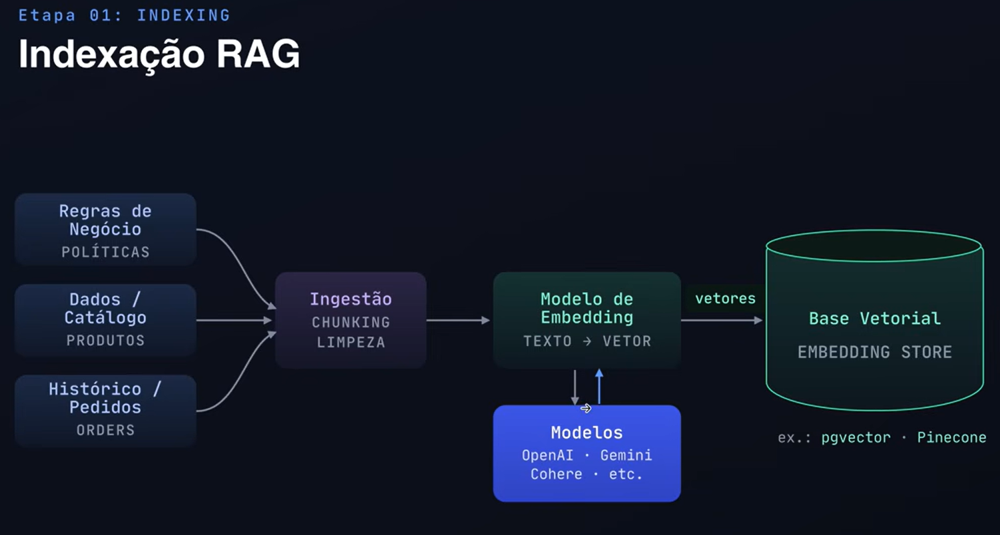
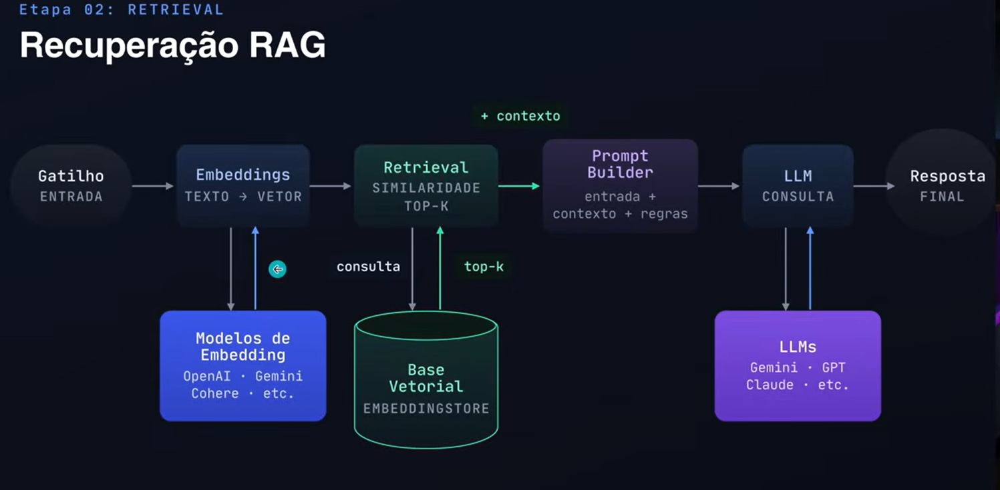

# POC: RAG (Retrieval-Augmented Generation) com Spring AI

Proof of Concept demonstrando como implementar um sistema de recomendação personalizada usando RAG com Spring AI, Google Gemini e PgVector.

## O que é RAG?

RAG (Retrieval-Augmented Generation) é uma técnica que combina recuperação de documentos com geração de texto por LLMs. Em vez de depender apenas do conhecimento treinado do modelo, o sistema recupera informações relevantes de uma base de conhecimento e as injeta no prompt, produzindo respostas mais precisas e contextualizadas.

### Fluxo Básico

```
┌─────────────┐     ┌──────────────┐     ┌─────────────┐     ┌─────────────┐
│   Usuário   │────▶│  Retrieval   │────▶│ Augmentation│────▶│ Generation  │
│   (Query)   │     │ (Busca Vet.) │     │ (Prompt)    │     │  (LLM)     │
└─────────────┘     └──────────────┘     └─────────────┘     └─────────────┘
                           │                    │                    │
                    ┌──────▼──────┐      ┌──────▼──────┐      ┌──────▼──────┐
                    │ Vector Store│      │  Contexto   │      │  Resposta   │
                    │ (PgVector)  │      │  Recuperado │      │  Gerada     │
                    └─────────────┘      └─────────────┘      └─────────────┘
```

## Caso de Uso: Recomendação de Passeios Turísticos

### Problema

Um marketplace de experiências turísticas precisa recomendar passeios personalizados para cada cliente, considerando:
- Interesses do cliente (inferidos do histórico)
- Localização do pedido (recomendar na mesma cidade)
- Evitar recomendar passeios já comprados

### Solução com RAG

1. **Indexação**: Cada passeio do catálogo é convertido em embedding vetorial e armazenado no PgVector
2. **Retrieval**: Ao receber um pedido, o sistema busca passeios similares e o histórico do cliente
3. **Augmentation**: O contexto recuperado é injetado no prompt do LLM
4. **Generation**: O LLM gera recomendações personalizadas em linguagem natural

## Implementação

### Stack

| Componente | Tecnologia | Função |
|------------|------------|--------|
| Framework | Spring Boot 4.1.0 | API REST e DI |
| AI Framework | Spring AI 2.0.0-RC2 | Abstrações para LLM e Vector Store |
| LLM | Gemini 2.5 Flash Lite | Geração de texto |
| Embeddings | Gemini Embedding 001 | Vetorização de texto (1536 dims) |
| Vector Store | PgVector | Armazenamento e busca vetorial |
| Banco | Neon PostgreSQL | Banco serverless |

### Estrutura de Código

```
src/main/java/com/highonline/rag/
├── config/
│   └── ChatClientConfig.java        # Configuração do LLM
├── model/
│   ├── ProductCreatedDto.java       # Modelo de produto
│   └── OrderCreatedDto.java         # Modelo de pedido
├── repository/
│   └── VectorStoreRepository.java   # Acesso ao PgVector
└── service/
    ├── ProductIndexingService.java  # Indexação de produtos
    ├── OrderIndexingService.java    # Indexação de histórico
    └── RecommendationService.java   # Pipeline RAG
```

### Fase 1: Indexação (Embedding + Storage)



Cada documento é transformado em embedding vetorial e armazenado:

```java
// ProductIndexingService.java
public Document index(ProductCreatedDto product) {
    String embeddableText = buildEmbeddableText(product);
    Document doc = new Document(embeddableText, metadata);
    vectorStoreRepository.save(doc);
    return doc;
}
```

**O que é armazenado:**
- Texto embeddado: nome, localização, categoria, descrição, tags, preço
- Metadados: productId, type="PRODUCT", location, category, price

### Fase 2: Retrieval (Busca Vetorial)



Busca por similaridade semântica usando filtros de metadados:

```java
// VectorStoreRepository.java
public List<Document> findSimilarProducts(String query, int topK) {
    String filter = "type == 'PRODUCT'";
    return vectorStore.similaritySearch(
        SearchRequest.query(query)
            .withFilterExpression(filter)
            .withTopK(topK)
    );
}

public List<Document> findCustomerHistory(UUID customerId, String query, int topK) {
    String filter = "type == 'ORDER_HISTORY' && customerId == '" + customerId + "'";
    return vectorStore.similaritySearch(
        SearchRequest.query(query)
            .withFilterExpression(filter)
            .withTopK(topK)
    );
}
```

**Buscas paralelas:**
1. Passeios similares ao pedido (top 4)
2. Histórico de compras do cliente (top 4)

### Fase 3: Augmentation (Construção do Prompt)

O contexto recuperado é injetado no prompt:

```java
// RecommendationService.java
private String buildAugmentedPrompt(OrderCreatedDto order,
                                     List<Document> similarProducts,
                                     List<Document> customerHistory) {
    return """
        Você é um assistente de recomendação de passeios turísticos.

        PASSEIOS DISPONÍVEIS:
        %s

        HISTÓRICO DE COMPRAS DO CLIENTE:
        %s

        PEDIDO ATUAL:
        Nome: %s
        Localização: %s

        Regras:
        - Recomende apenas passeios na mesma cidade/região
        - Nunca recomende passeios já comprados
        - Limite a 3 recomendações
        - Responda em português brasileiro
        """.formatted(similarProductsText, historyText,
                     order.orderName(), order.orderLocation());
}
```

### Fase 4: Generation (Chamada ao LLM)

```java
// RecommendationService.java
public String recommendFor(OrderCreatedDto order) {
    // 1. Retrieval
    List<Document> similarProducts = repository.findSimilarProducts(query, 4);
    List<Document> customerHistory = repository.findCustomerHistory(customerId, query, 4);

    // 2. Augmentation
    String prompt = buildAugmentedPrompt(order, similarProducts, customerHistory);

    // 3. Generation
    return chatClient.prompt()
        .user(prompt)
        .call()
        .content();
}
```

## Resultados

### Teste: Pedido em Roma

**Input:**
```json
{
  "orderName": "Vatican Museums & Sistine Chapel Tour",
  "orderLocation": "Rome, Italy"
}
```

**Output (gerado pelo LLM):**
```
Baseado no seu interesse em museus e história em Roma, recomendo:

1. **Colosseum Underground Tour** - Explore os subterrâneos do Coliseu,
   uma experiência única que complementa perfeitamente sua visita ao Vaticano.

2. **Trastevere Food Tour by Night** - Conheça a Roma autêntica através
   da gastronomia no bairro mais charmoso da cidade.

3. **Borghese Gallery Guided Visit** - Outra joia da arte italiana,
   com uma coleção impressionante de esculturas e pinturas.
```

### Métricas

| Métrica | Valor |
|---------|-------|
| Latência total | ~3-5s |
| Retrieval | ~200ms |
| Geração (LLM) | ~2-3s |
| Embedding dimensions | 1536 |
| Vector search accuracy | HNSW (cosine) |

## Configuração do Ambiente

### Variáveis Necessárias

```bash
# PostgreSQL (Neon)
export DB_URL="jdbc:postgresql://<endpoint>.neon.tech/recommendation-agent?sslmode=require"
export DB_USERNAME="neondb_owner"
export DB_PASSWORD="<password>"

# Google Gemini
export GEMINI_API_KEY="<api-key>"
```

### Execução

```bash
# Instalar dependências
asdf install

# Rodar aplicação
make run

# Indexar catálogo de demonstração
curl -X POST http://localhost:8080/demo/index-catalog

# Testar recomendação
curl -X POST http://localhost:8080/demo/orders \
  -H "Content-Type: application/json" \
  -d '{"orderId":"33333333-3333-3333-3333-333333333333","customerId":"11111111-1111-1111-1111-111111111111","orderName":"Vatican Museums & Sistine Chapel Tour","orderLocation":"Rome, Italy"}'
```

## Lições Aprendidas

### O que Funcionou

1. **Filtros por metadados**: Essencial para restringir buscas por tipo e cliente
2. **Buscas paralelas**: Histórico + catálogo simultâneos reduzem latência
3. **Embeddings de 1536 dims**: Boa qualidade semântica com Gemini
4. **HNSW index**: Buscas rápidas mesmo com milhares de documentos

### Limitações

1. **Sem memória de sessão**: Cada request é independente (sem histórico de conversas)
2. **Filtros simples**: Metadados usam comparação exata (sem range ou fuzzy)
3. **Sem re-ranking**: Resultado bruto do vector search (poderia usar cross-encoder)
4. **Custo por embedding**: Cada documento gera uma chamada à API de embedding

### Próximos Passos

1. **Conversational Memory**: Manter histórico de conversas para contexto
2. **Hybrid Search**: Combinar busca vetorial com BM25 (texto)
3. **Re-ranking**: Usar cross-encoder para reordenar resultados
4. **Streaming**: Retornar resposta em tempo real via SSE
5. **Avaliação**: Métricas de qualidade (relevância, diversidade)

## Referências

- [Spring AI RAG Documentation](https://docs.spring.io/spring-ai/reference/api/retrieval-augmented-generation.html)
- [PgVector Store](https://docs.spring.io/spring-ai/reference/api/vectordstores/pgvector.html)
- [Google Gemini Integration](https://docs.spring.io/spring-ai/reference/api/chat/google-gemini.html)
- [RAG Paper (Lewis et al., 2020)](https://arxiv.org/abs/2005.11401)
